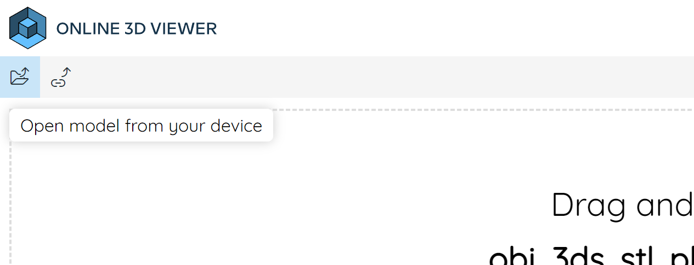
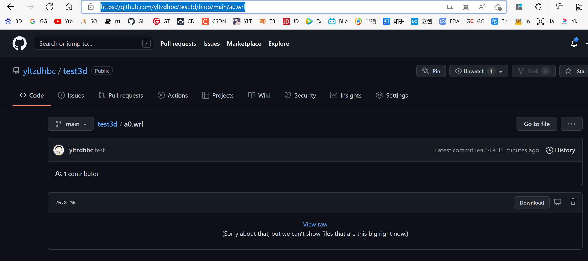
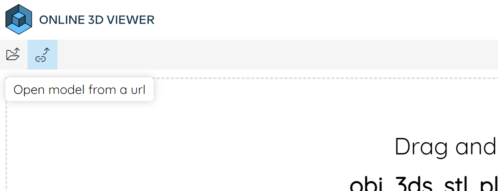
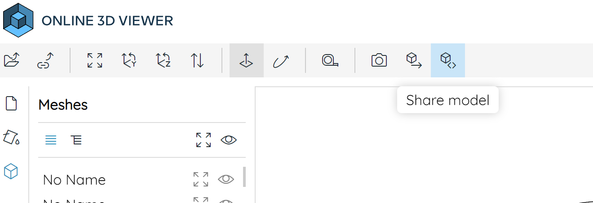
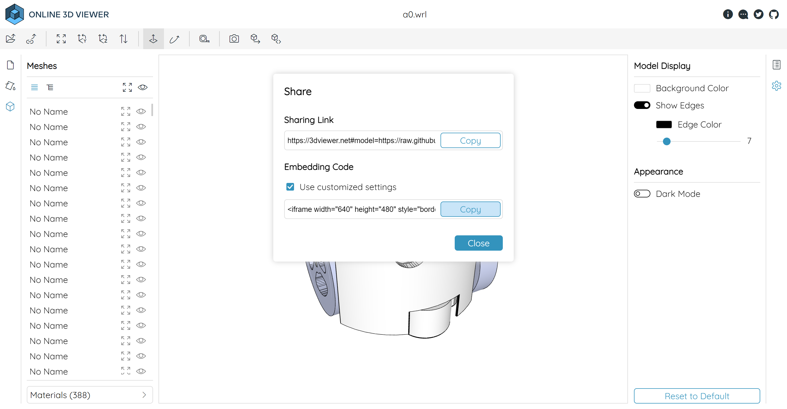

## 效果
<div class="iframe_viewer">
    <iframe src="https://3dviewer.net/embed.html#model=https://blog-1303691209.cos.ap-nanjing.myqcloud.com/models/lab_s.3mf$envsettings=fishermans_bastion,off$backgroundcolor=255,255,255$defaultcolor=200,200,200$edgesettings=on,0,0,0,10"
    scrolling="no" border="0" frameborder="no" framespacing="0" allowfullscreen="true"> </iframe>
</div>


## 插入到网页中

### 打开项目地址

项目地址：[Online 3D Viewer](https://3dviewer.net/index.html)

### 浏览模型效果

点击`Open model from your device`查看本地模的效果



### 上传插入博客

#### 上传

将模型文件上传到`Github`，复制文件地址链接，比如`https://github.com/yltzdhbc/test3d/blob/main/a0.wrl`



#### 解析

再次打开项目地址：[Online 3D Viewer](https://3dviewer.net/index.html)，点击`Open model from a url`，输入上述的地址



#### 分享

点击`Share model`



点击`copy`，复制链接



#### 插入

从上述链接中复制得到的代码如下

```html
<iframe width="640" height="480" style="border:1px solid #eeeeee;" src="https://3dviewer.net/embed.html#model=https://raw.githubusercontent.com/yltzdhbc/test3d/main/a0.wrl$camera=-0.10019,0.08508,0.10031,-0.05003,0.01821,0.00000,0.00000,1.00000,0.00000$envsettings=fishermans_bastion,off$backgroundcolor=255,255,255$defaultcolor=200,200,200$edgesettings=on,0,0,0,7"></iframe>
```

将其中`src`字段内容复制出来，粘贴在下面`iframe`的`src`中

```html
<div style={{height: "60vh"}}>
<iframe
  width="100%"
  height="100%"
  scrolling="no"
  src="https://3dviewer.net/embed.html#model=https://raw.githubusercontent.com/yltzdhbc/test3d/main/a0.wrl$camera=-0.10019,0.08508,0.10031,-0.05003,0.01821,0.00000,0.00000,1.00000,0.00000$envsettings=fishermans_bastion,off$backgroundcolor=255,255,255$defaultcolor=200,200,200$edgesettings=on,0,0,0,7"
></iframe>
</div>
```

